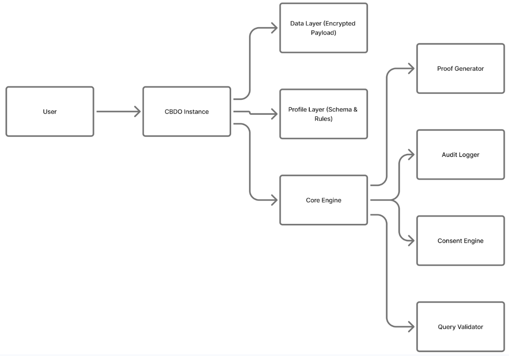
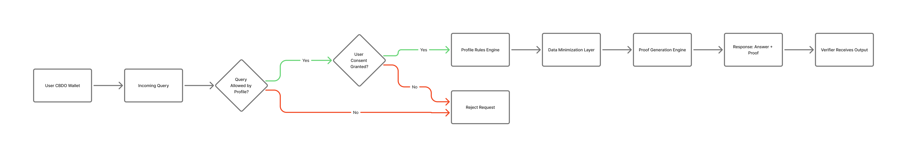
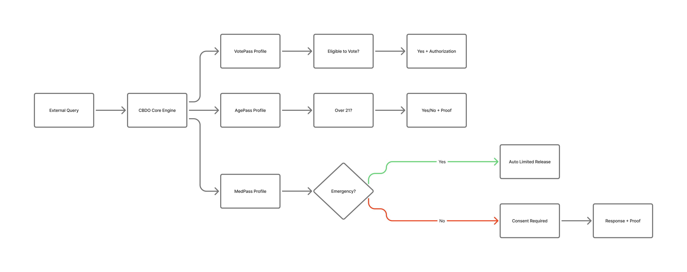
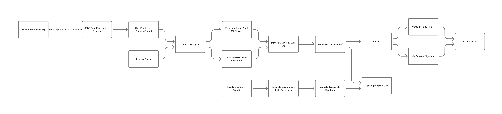

# **Verifiable Minimal Disclosure (VMD)**

*A Privacy-First Architecture for Verifiable Digital Truth*

# **Abstract**

Modern digital systems are built on a flawed assumption: that trust requires exposing raw data. This has produced systemic failures – data breaches, over-collection, regulatory burden, and user distrust.

Verifiable Minimal Disclosure (VMD) offers a different model. Built on emerging standards such as W3C Verifiable Credentials, VMD extends them into a complete interaction and governance model. Rather than sharing data, VMD allows systems to ask questions of data and receive verifiable answers – without exposing the underlying information. This enables privacy-preserving verification, user ownership, and controlled disclosure, while satisfying real-world requirements such as legal access and fraud detection.

In 2026, with age-verification mandates accelerating globally (including Australia’s enforcement starting March 9 for porn, R-rated games, AI chatbots and more), the need for such an architecture has become urgent. **AgePass** – the first specialized VMD profile – directly addresses this regulatory pressure while preserving adult privacy.

*VMD represents a foundational shift: from data exchange to truth verification.*

# **1\. Introduction**

## **1.1 Problem Statement**

Modern digital systems are built on a fundamental assumption: that trust requires access to raw data. As a result, even simple verification tasks routinely involve the transfer, storage, and replication of sensitive information.

This pattern has produced systemic issues:

* Excessive data collection beyond what is required for a given interaction   
* Expansion of attack surfaces through widespread data duplication   
* Increasing regulatory burden associated with storage, access, and retention   
* Erosion of user trust due to repeated exposure of personal information 

In practice, verifying a simple claim – such as age eligibility, professional credentials, or medical conditions – often requires disclosure of full underlying records. This coupling of verification and data exposure is inefficient, risky, and increasingly incompatible with modern privacy expectations and regulatory frameworks.

## **1.2 Proposed Approach**

Verifiable Minimal Disclosure (VMD) introduces an alternative model.

Rather than exchanging data, VMD systems enable verification through **controlled, query-based interaction**. External parties submit narrowly scoped questions and receive minimal, verifiable responses, without gaining access to the underlying data.

For example:

* “Is this individual over 21?” → Verified response returned   
* Date of birth → never disclosed 

This approach preserves the ability to verify truth while eliminating unnecessary data exposure.

## **1.3 Scope**

This document defines the VMD model as:

* An interaction pattern for privacy-preserving verification   
* An architectural framework for enforcing policy and consent   
* A foundation for domain-specific implementations (e.g., AgePass, MedPass, CareerPass) 

The model is designed to build upon existing standards, including W3C Verifiable Credentials, while extending them to support active, query-based verification and governed disclosure.

## **1.4 Design Objective**

The objective of VMD is to decouple **verification** from **data exposure**.

By ensuring that systems return only the minimal, verifiable result required for a given interaction, VMD enables privacy, security, and regulatory compliance to coexist without requiring the movement or duplication of sensitive data.

# **2\. The VMD Model**

**Verifiable Minimal Disclosure (VMD)** is a model in which systems answer narrowly scoped questions by returning the smallest possible, verifiable result without exposing underlying data.

Rather than granting direct access to data, VMD defines an interaction pattern:

Query → Policy → Consent → Response

External systems do not retrieve data. They submit constrained queries. The VMD system evaluates those queries against defined rules, enforces user consent, processes the underlying data internally, and returns only the minimal result required to satisfy the request.

Key characteristics:

**Data remains private and non-extractable**  

* Underlying data is never exposed during standard interactions.

  **Interaction is query-based, not access-based**  

* External systems cannot read data directly; they can only ask predefined questions.

  **Responses are minimal and verifiable**  

* Outputs are constrained to the smallest useful answer (e.g., boolean, range proof) and are cryptographically provable.

  **Execution is policy-enforced and consent-gated**  

* All interactions are evaluated against explicit rules and user-defined consent requirements.

  **All activity is auditable ** 

* Each interaction produces a verifiable record, enabling accountability without exposing sensitive data.

In this model, data does not move between systems. Instead, it remains in place and becomes **queryable under strict control**, shifting digital trust from data exchange to verifiable answers.

# **3\. Conceptual Model**

## **3.1 Safety Deposit Box Analogy**

The VMD model can be understood using a familiar analogy: a safety deposit box.

A user stores sensitive information in a secured location. External parties cannot access the contents directly. Instead, they may request specific, narrowly scoped answers about what is inside.

The system evaluates each request, enforces applicable rules, and returns only the permitted result.

For example:

* A verifier may ask: “Is this individual over 21?” 

* The system evaluates the request internally   
* A minimal, verifiable response is returned   
* The underlying data (e.g., date of birth) is never exposed 

This analogy illustrates a key distinction:

**Access to data is replaced by controlled, query-based verification.**  
Under defined conditions – such as legal authorization or emergency access – broader disclosure may be permitted. These cases are governed by explicit policy and are auditable.

## **3.2 Conceptual Boundaries**

The analogy is illustrative, but not literal.

A VMD system is not simply a secure container for data. It is a **policy-enforced interaction model** in which:

* Data remains internal and non-extractable   
* External systems cannot read or retrieve raw information   
* All interactions are mediated through constrained queries   
* Responses are generated, not retrieved 

In this model, data becomes **queryable under strict control**, and verification occurs without transferring or exposing the underlying information.

# **4\. Architecture**

A VMD consists of three primary layers that enforce strict separation between data storage, policy definition, and execution logic.

*Figure 1 – VMD Internal Architecture*  
**

## **4.1 Data Layer (Encrypted Payload)**

Stores raw user data – fully encrypted at rest and in transit. Never directly exposed during standard operations.

*Examples: date of birth, medical records, employment history.*

## **4.2 Profile Layer (Schema / Contract)**

Defines the rules governing each VMD-based credential: allowed queries, permissible responses, disclosure limits, and proof requirements. Each profile specifies what can be queried, what can be answered, and under what conditions.

## **4.3 Core Engine (Execution Layer)**

Handles all interactions: query validation, consent enforcement, rule application, data minimization, proof generation, and audit logging. This layer transforms VMD-based credentials from static containers into active verification systems.

# **5\. Operational Flow**

*Figure 2 – VMD Query Processing Flow*
**

This flow represents the standard interaction pattern for all VMD queries, regardless of profile type:

1. External system submits a query (e.g., "Is this user over 21?")

2. VMD validates the request against its profile

3. Consent rules are evaluated

4. Data is processed internally

5. A minimal, verifiable response is returned – no raw data disclosed

# **6\. Core Principles**

## **6.1 Data Minimization**

Only the necessary answer is shared – never the full dataset.  
   
## **6.2 Query-Based Interaction**

Systems do not access data directly; they query it. This keeps the data layer isolated from external parties at all times.

## **6.3 User Ownership**

Users control access permissions, consent policies, and disclosure rules. No query proceeds without passing user-defined consent checks.

## **6.4 Schema Enforcement**

Profiles prevent arbitrary data requests, scope creep, and information leakage. The profile is a binding contract, not a suggestion.

## **6.5 Verifiability**

All responses are cryptographically provable and auditable. Trust does not depend on the honesty of any single party.

## **6.6 Controlled Override**

VMD supports lawful and emergency access – legal warrants, medical emergencies, fraud investigations – under strict, auditable conditions. This ensures real-world regulatory alignment without weakening everyday privacy guarantees.
  
# **7\. Standardized VMD Profiles**

Profiles define domain-specific implementations of the VMD model. 

*Figure 3 – VMD Profile Interaction Model**

## **7.1 AgePass**

Purpose: Age verification without revealing date of birth– directly addressing 2026 mandates in Australia (effective March 9 for adult content, R-rated games, AI systems, etc.), the UK Online Safety Act, EU DSA guidelines, and multiple US state laws.

*Queries: “Over 18?” / “Over 21?” → Output: Boolean \+ verifiable proof.*   
*No date of birth or other personal data disclosed*

AgePass demonstrates how VMD can help platforms comply with child-safety regulations while avoiding the privacy pitfalls of repeated ID uploads, facial scans, or centralized data collection.

## **7.2 MedPass**

Purpose: Controlled medical data disclosure with pre-consented sharing and emergency override capability.

*Example queries: "Known allergies?" / "Current medications?"*

## **7.3 VotePass**

Purpose: Secure voting verification – eligibility confirmation, duplicate vote prevention, and privacy-preserving participation tracking. Override available for fraud investigation under audit conditions.

*Example queries: "Eligible to vote?" / “Registered?” / "Resident of which Precinct?"*

## **7.4 CareerPass**

Purpose: Professional credential verification. Enables query-based verification for hiring systems. 

*Example queries: "Was this role held?" / "Is this certification valid?"*

## **7.5 Competitive Landscape and Differentiation**

Numerous reusable age-assurance pilots and commercial offerings have emerged by early 2026, including Yoti Keys (passkey-based anonymous tokens), AgeAware from the euCONSENT consortium (interoperable cryptographic tokens), Ondato OnAge, OpenAge AgeKeys, and various biometric or estimation-based solutions. Many leverage wallet concepts or selective disclosure and are actively trialed in Australia, the UK, and EU contexts to address the same regulatory wave.

VMD builds on and extends these approaches by providing a cohesive, enforceable architecture built directly on W3C Verifiable Credentials 2.0 and BBS+ as the cryptographic backbone. What sets VMD-based credentials apart is an active Core Engine that transforms static credentials into policy-enforced, query-responsive systems: every interaction is validated against a strict profile, user consent is programmatically enforced, responses are strictly minimized, and every action is auditable by design.

Most importantly, VMD incorporates a governed threshold-cryptography override for lawful and emergency access that is cryptographically prevented from unilateral abuse – a critical real-world requirement that many token-based pilots address only through policy or third-party trust. By adding these governance, consent, and exception layers on top of existing standards and pilots, VMD (starting with AgePass) deliver stronger privacy guarantees, better regulatory alignment, and true user ownership at scale, rather than simply moving the trust boundary to a new intermediary network.

# **8\. Paradigm Shift**

VMD reorients every layer of the data interaction model:

| Old Model | VMD Model |
| :---- | :---- |
| Share data | **Answer questions** |
| Trust documents | **Verify proofs** |
| Over-disclosure | **Minimal disclosure** |
| Centralized storage | **User-owned objects** |

# **9\. Trust Authorities and Governance Model**

VMD introduces a new institutional responsibility: the ability to attest to truth, enforce its usage, and authorize its disclosure – without ever exposing raw data. This responsibility is fulfilled by Trust Authorities (TAs).

## **9.1 Definition**

A Trust Authority is an organization or system responsible for verifying real-world data, attesting to its accuracy, issuing signed VMD-based credentials, and enforcing policy constraints on their usage. Trust Authorities function as the root of trust within the VMD ecosystem.

## **9.2 Role: From Data Holders to Truth Attestors**

Rather than storing and sharing raw data, Trust Authorities verify data once, issue cryptographically signed VMD-based credentials, and enable controlled, query-based verification thereafter. The institutional model shifts from custodianship to attestation.

## **9.3 Core Functions**

**Attestation (Issuance Layer)**

Trust Authorities validate real-world claims and bind them to a VMD-based credential – performing identity verification, credential validation, and data authenticity checks. Output: a signed VMD with cryptographic proof of origin.

Examples: a bank issues an AgePass VMD-based credential; a hospital issues a MedPass VMD-based credential; Applicert issues a professional VMD-based credential.

**Policy Governance (Rules Layer)**

Trust Authorities define profile schemas, specify allowable queries, enforce data minimization constraints, and define override conditions. These rules are encoded into VMD profiles and enforced automatically by the Core Engine.

**Authorization (Exception Layer)**

Under exceptional conditions – courts issuing digitally signed warrants, emergency systems authorizing medical access, regulators initiating audits – Trust Authorities manage controlled access.

*Humans authorize access. Systems execute it. All overrides are logged, verifiable, and restricted by policy.*

## **9.4 Separation of Roles**

The VMD model distinguishes between two classes of authority to prevent abuse and ensure scalability:

**Issuers (High Trust Authorities)**

Entities that create and sign VMD-based credentials – banks, hospitals, professional verification platforms, government registries. These entities establish truth and anchor trust.

**Authorizers (Conditional Authorities)**

Entities that enable access under defined conditions – courts, emergency responders, regulatory bodies. These entities do not create or directly access raw data; they authorize constrained access only.

## **9.5 Trust Chain**

*Issuer → VMD-Based Credential → Query Response → Verifier*

The issuer signs and attests to data. The VMD system enforces rules and generates responses. The verifier validates proofs and signatures – without ever needing to trust the user directly or access raw data.

## **9.6 Institutional Mapping**

Trust Authorities map naturally to existing institutions, enabling VMD integration rather than wholesale replacement.

| Banking | Identity attestation |
| :---- | :---- |
| **Healthcare** | Medical data authority |
| **Legal System** | Warrant issuance and audit authorization |
| **Employment** | Credential and experience verification |

## **9.7 Accountability**

Trust Authorities are accountable for the accuracy of issued VMD-based credentials, the integrity of their signing keys, and the enforcement of policy rules. All actions are logged, auditable, and cryptographically verifiable.

*Trust is measurable, not assumed.*

Over time, Trust Authorities are expected to evolve into a federated ecosystem of interoperable attestors – a distributed trust network rather than any single centralized authority.

# **10\. Applicert: A Practical Implementation Path**

## **10.1 Current State of Professional Verification**

Hiring today relies on self-reported resumes, weak verification signals, and time-intensive manual validation. The result is fraud, inefficiency, and misplaced trust in credentials that cannot be confirmed quickly or reliably.

## **10.2 VMD Integration**

Applicert represents a practical initial implementation of a Trust Authority within the VMD ecosystem, and CareerPass (defined in Section 7.4) is its first VMD profile. As a professional verification platform, Applicert:

* Attests to employment and credential claims

* Issues signed VMD-based professional profiles (CareerPass)

* Enables query-based verification for hiring systems

In this role, Applicert functions simultaneously as a VMD issuer, a verification authority, and a profile standard creator – with CareerPass as the reference implementation of that model.

CareerPass in practice – an employer queries:

* "Was this role held?"  →  Verified. No raw employment record disclosed.

* "Is this certification valid?"  →  Verified. No transcript or credential file disclosed.

## **10.3 Outcomes**

* Faster, more confident hiring decisions

* Significant reduction in credential fraud

* Improved fairness – verification based on proof, not presentation

* A trusted, scalable signal in the hiring market

## **10.4 Standards Alignment and Foundations**

VMD is deliberately designed to build upon mature, open standards rather than replace them. In particular, they leverage the **W3C Verifiable Credentials Data Model v2.0** (Recommendation, May 2025\) as the foundational backbone for the Data Layer, Profile/Schema Layer, and core Verifiability mechanisms.

Combined with the W3C Data Integrity BBS+ cryptosuite for selective disclosure, VMD inherits strong interoperability, existing wallet support, and proven cryptographic tooling. The VMD **Core Engine** then adds the missing active layers: strict query-based interaction, enforceable consent rules, data-minimization guarantees, comprehensive audit logging, and a governed threshold-cryptography override for lawful access.

This approach positions VMD as a natural evolution of ongoing pilots (including reusable age tokens and EU “mini-wallet” efforts) while addressing real-world gaps in consent governance and controlled exceptions. Decentralized Identifiers (DIDs) are expected to serve as the recommended mechanism for user-controlled key management and wallet interoperability; further architectural details in this area will incorporate expert review.

# **11\. Cryptographic Foundations**

VMD is built on well-established cryptographic techniques used in modern security infrastructure – including secure web browsing (TLS), digital identity frameworks, and government-grade authentication systems. This section explains how these techniques work together in the VMD model.

*Figure 4 – VMD Cryptographic Verification Flow*
**

*This diagram illustrates how VMD combines selective disclosure (BBS+), zero-knowledge proofs, and threshold cryptography to enable verifiable answers without exposing underlying data.*

## **11.1 The Core Problem VMD Solves Cryptographically**

Traditional data systems prove a claim by showing the underlying data. A bar shows your full ID to confirm you are over 21\. A hospital shares your entire record to confirm a single allergy.

VMD separates the claim from the data that supports it. Cryptography is what makes this separation trustworthy – so that a verified YES carries the same legal and practical weight as seeing the raw data directly.

## **11.2 Selective Disclosure via BBS+ Signatures**

VMD uses a cryptographic scheme called BBS+ signatures – a standard developed and maintained by the World Wide Web Consortium (W3C) and already in use in decentralized digital identity systems globally.

BBS+ allows an issuer (a Trust Authority) to sign a full data record – a credential containing name, date of birth, address, and employment history – in such a way that the holder can later prove individual fields from that record without revealing the rest. Crucially, the verifier can confirm the proof is valid without seeing the hidden fields and without contacting the original issuer.

*This is what enables queries like "Is this person over 21?" to return*   
*a cryptographically verifiable YES – with no date of birth disclosed.*

## **11.3 Zero-Knowledge Proofs for Query Responses**

For query responses that go beyond simple field disclosure – proving that a value falls within a range, or that two credentials are held by the same person – VMD is designed to support zero-knowledge proofs (ZKPs).

A zero-knowledge proof allows one party to prove that a statement is true without revealing why it is true or what data supports it. The mathematics underlying ZKPs are well-established and peer-reviewed; they are used today in financial privacy systems, government identity programs, and blockchain networks.

In the VMD model, ZKPs allow the Core Engine to answer queries like "Is this person's credit score above 700?" with a verifiable YES – without exposing the actual score, the underlying financial data, or any other information.

ZKP integration is built into the VMD architecture from the outset, ensuring that as implementations mature, stronger privacy guarantees can be adopted without redesigning the system.

## **11.4 The Chain of Trust**

Every VMD-based credential carries a chain of cryptographic signatures:

* The Trust Authority signs the original data at issuance, attesting to its accuracy

* The VMD holds that signature as proof of legitimacy

* When a query is answered, the response carries a proof that it was derived from that signed data

A verifier – an employer, a healthcare provider, a government system – does not need to trust the user directly. They trust the mathematics and the issuing authority. Forging or altering any link in this chain is computationally infeasible under current cryptographic standards.

## **11.5 Key Management and User Ownership**

Each VMD-based credential is associated with a cryptographic key pair – a private key controlled by the user, and a public key used by verifiers. The private key is required to authorize queries and consent to disclosure.

Key management is one of the genuine practical challenges of user-controlled cryptography, and VMD addresses this honestly: recovery mechanisms exist, but they involve defined, auditable processes rather than silent third-party access. Implementations may support recovery through trusted contacts, institutional key custodians, or hardware security devices – each with explicit tradeoffs between user sovereignty and recoverability that are disclosed at onboarding.

## **11.6 Controlled Override: How Privacy and Legal Access Coexist**

VMD-based credentials are private by default, but are not designed to be beyond the reach of legitimate legal authority. These two goals are made compatible through threshold cryptography.

Under this model, no single party – not the user, not Applicert, not any Trust Authority – holds a complete decryption key. Access to raw VMD-based credential contents under a legal warrant requires the cooperation of multiple independent authorized parties (for example, the user's key custodian, the issuing Trust Authority, and a designated legal compliance authority). Each cooperation event is cryptographically logged and independently verifiable.

This design ensures:

* Unauthorized unilateral access is cryptographically prevented – not merely prohibited by policy, but cryptographically prevented

* Lawful access is possible but requires documented, auditable multi-party cooperation

* The existence of an override mechanism does not weaken everyday privacy guarantees

## **11.7 Audit Integrity**

Every VMD interaction generates an audit record stored in a cryptographically append-only log – meaning entries can be added but not altered or deleted without detection. This is the same structure used in certificate transparency systems that underpin secure web browsing.

This allows regulators, users, and auditors to verify the complete history of a VMD-based credential's usage – including any override events – without relying on any single party's honesty.

# **12\. Future Implications**

The VMD model extends well beyond its initial applications. As Trust Authority networks mature and cryptographic tooling (built on W3C VCs and related standards) becomes more accessible, VMD-based credentials provide the underlying infrastructure for identity systems, healthcare interoperability, financial verification, governance, and more.

*VMD forms the basis for a universal trust layer for digital interactions.*

# **13\. Conclusion**

VMD redefines how data functions in digital systems. The shift is not incremental – it is architectural. Data stops being a thing that moves between parties and becomes something that answers questions in place.

In doing so, VMD enables privacy, security, efficiency, and verifiable trust to coexist at scale – across industries, jurisdictions, and use cases.

# 

# **14\. Final Statement**

*VMD-based credentials are not files. They are interactive, rule-bound truth systems.*

VMD systems are policy-enforced, query-responsive verification systems that return minimal, verifiable answers instead of raw data.

As such, they represent not just a product innovation, but a protocol-level evolution of digital trust infrastructure – one built to meet the demands of a world that can no longer afford to equate access with trust.

This whitepaper is accompanied by a reference implementation: [https://github.com/applicert/vmd-core-engine](https://github.com/applicert/vmd-core-engine) 

This project was previously developed under the working term "CBDO" (Consent-Based Data Objects).

© 2026 William Brian Williams. All rights reserved.
